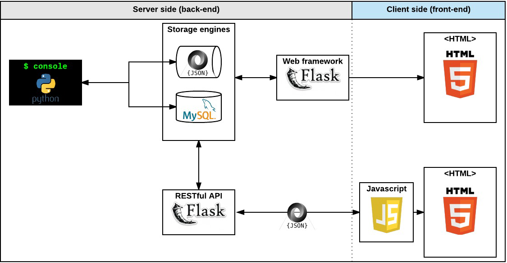
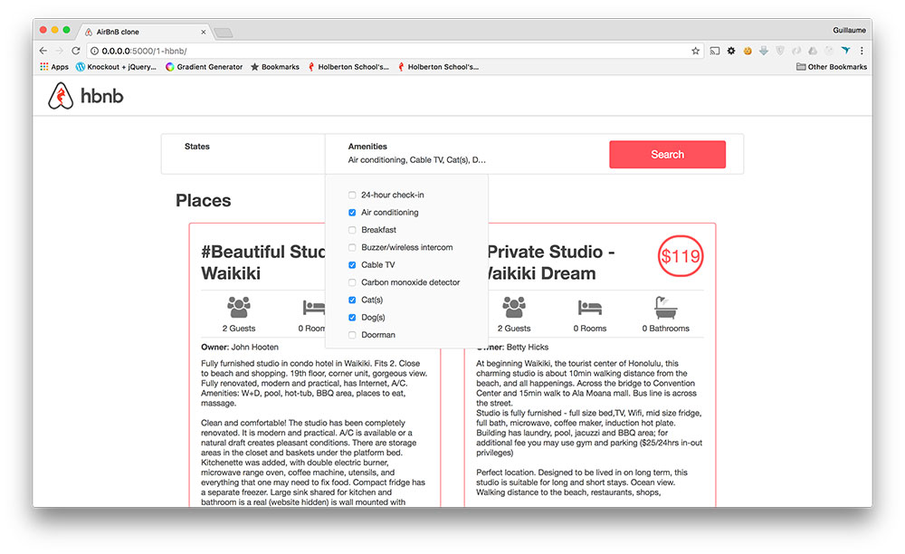
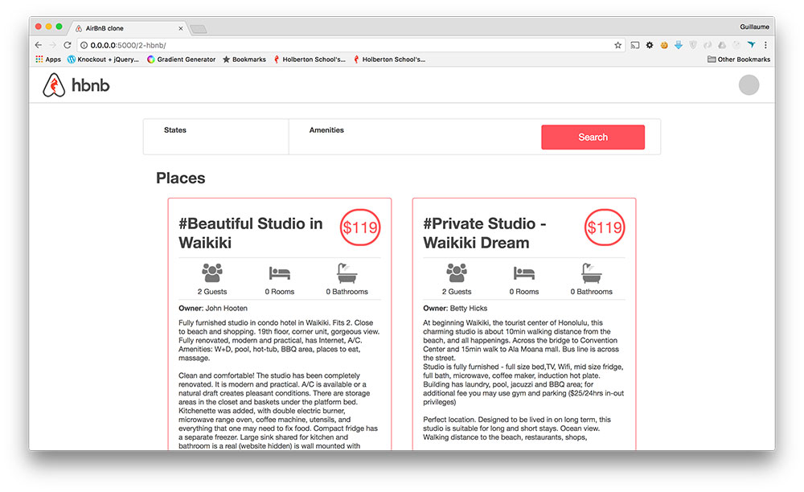

# AirBnB clone - Web dynamic

  

    <h2>Resources</h2>

<strong>Read or watch</strong>:

<ul>
<li><a href="https://jquery-tutorial.net/selectors/using-elements-ids-and-classes/" title="Selector" target="_blank">Selector</a> </li>
<li><a href="https://jquery-tutorial.net/dom-manipulation/getting-and-setting-content/" title="Get and set content" target="_blank">Get and set content</a> </li>
<li><a href="https://jquery-tutorial.net/dom-manipulation/getting-and-setting-css-classes/" title="Manipulate CSS classes" target="_blank">Manipulate CSS classes</a> </li>
<li><a href="https://jquery-tutorial.net/dom-manipulation/the-append-and-prepend-methods/" title="Manipulate DOM elements" target="_blank">Manipulate DOM elements</a> </li>
<li><a href="https://learn.jquery.com/using-jquery-core/document-ready/" title="Document ready" target="_blank">Document ready</a> </li>
<li><a href="https://jquery-tutorial.net/ajax/introduction/" title="Introduction" target="_blank">Introduction</a> </li>
<li><a href="https://jquery-tutorial.net/ajax/the-get-and-post-methods/" title="GET &amp; POST request" target="_blank">GET &amp; POST request</a> </li>
<li><a href="https://developer.mozilla.org/en-US/docs/Web/HTTP/CORS" title="HTTP access control (CORS)" target="_blank">HTTP access control (CORS)</a> </li>
</ul>

<h2>Learning Objectives</h2>

At the end of this project, you are expected to be able to <a href="/rltoken/x4ZVwAvxdN7f6ZwP4hPoRQ" title="explain to anyone" target="_blank">explain to anyone</a>, <strong>without the help of Google</strong>:

<h3>General</h3>

<ul>
<li>How cool it is to request your own API</li>
<li>How to modify an HTML element style</li>
<li>How to get and update an HTML element content</li>
<li>How to modify the DOM</li>
<li>How to make a <code>GET</code> request with JQuery Ajax</li>
<li>How to make a <code>POST</code> request with JQuery Ajax</li>
<li>How to listen/bind to DOM events</li>
<li>How to listen/bind to user events</li>
</ul>

<h2>Requirements</h2>

<h3>General</h3>

<ul>
<li>Allowed editors: <code>vi</code>, <code>vim</code>, <code>emacs</code></li>
<li>All your files will be interpreted on Chrome (version 57.0)</li>
<li>All your files should end with a new line</li>
<li>A <code>README.md</code> file, at the root of the folder of the project, is mandatory</li>
<li>Your code should be <code>semistandard</code> compliant with the flag <code>--global $</code>: <code>semistandard (something).js --global $</code></li>
<li>All your JavaScript must be in the folder <code>scripts</code></li>
<li>You must use JQuery version 3.x</li>
<li>You are not allowed to use <code>var</code></li>
<li>HTML should not reload for each action: DOM manipulation, update values, fetch data&hellip;</li>
</ul>

<h3>GitHub</h3>

<strong>There should be one project repository per group. If you clone/fork/whatever a project repository with the same name before the second deadline, you risk a 0% score.</strong>

<h2>More Info</h2>

<h3>Import JQuery</h3>

<pre><code>&lt;head&gt;
    &lt;script src=&quot;https://code.jquery.com/jquery-3.2.1.min.js&quot;&gt;&lt;/script&gt;
&lt;/head&gt;
</code></pre>

<h3>Before starting the project&hellip;</h3>

You will work on a codebase using <a href="/rltoken/TC9ahZWJWQmSl3XVRKsEZg" title="Flasgger" target="_blank">Flasgger</a>, you will need to install it locally first before starting the RestAPI:

<pre><code>$ sudo apt-get install -y python3-lxml
$ sudo pip3 install flask_cors # if it was not installed yet
$ sudo pip3 install flasgger
</code></pre>

If the RestAPI is not starting, please read the error message. 
Based on the(ses) error message(s), you will have to troubleshoot potential dependencies issues. 

Here some solutions:

<h4><code>jsonschema</code> exception</h4>

<pre><code>$ sudo pip3 uninstall -y jsonschema 
$ sudo pip3 install jsonschema==3.0.1
</code></pre>

<h4><code>No module named &#39;pathlib2&#39;</code></h4>

<pre><code>$ sudo pip3 install pathlib2
</code></pre>

<h3>Expose ports from your Vagrant</h3>

In your <code>Vagrantfile</code>, add this line for each port forwarded

<pre><code># I expose the port 5001 of my vm to the port 5001 on my computer
config.vm.network :forwarded_port, guest: 5001, host: 5001 
</code></pre>

if you need to expose other ports, same line but you will need to replace the &ldquo;guest port&rdquo; (inside your vagrant) and your &ldquo;host port&rdquo; (outside your vagrant, used from your browser for example)

It&rsquo;s important in your project, to use the AirBnB API with the port <code>5001</code>

 
 

<h3>Manual QA Review</h3>

<strong>It is your responsibility to request a review for this project from a peer before the project&rsquo;s deadline. If no peers have been reviewed, you should request a review from a TA or staff member.</strong>

  

   <h3 class="panel-title">
      0. Last clone!
    </h3>

 

  

   

   <!-- Progress vs Score -->
   

   

   

   

   

   

   Score: 0% (Checks completed: 0%)
   

   

   <!-- Task Body -->
   
A new codebase again? Yes!

For this project you will fork this <a href="/rltoken/Ht4-G-5nt-6oHdOL2_zkpA" title="codebase" target="_blank">codebase</a>:

<ul>
<li>Update the repository name to <code>AirBnB_clone_v4</code></li>
<li>Update the <code>README.md</code>:

<ul>
<li>Add yourself as an author of the project</li>
<li>Add new information about your new contribution</li>
<li>Make it better!</li>
</ul></li>
<li>If you&rsquo;re the owner of this codebase, create a new repository called <code>AirBnB_clone_v4</code> and copy over all files from <code>AirBnB_clone_v3</code> </li>
<li>If you didn&rsquo;t install Flasgger from the previous project, it&rsquo;s time! <code>sudo pip3 install flasgger</code></li>
</ul>

  

    <h3 class="panel-title">
      1. Cash only
    </h3>

  

  

    

   <!-- Progress vs Score -->

   <!-- Task Body -->
  
Write a script that starts a Flask web application:

<ul>
<li>Based on <code>web_flask</code>, copy: <code>web_flask/static</code>, <code>web_flask/templates/100-hbnb.html</code>, <code>web_flask/__init__.py</code> and <code>web_flask/100-hbnb.py</code> into the <code>web_dynamic</code> folder</li>
<li>Rename <code>100-hbnb.py</code> to <code>0-hbnb.py</code></li>
<li>Rename <code>100-hbnb.html</code> to <code>0-hbnb.html</code></li>
<li>Update <code>0-hbnb.py</code> to replace the existing route to <code>/0-hbnb/</code></li>
</ul>

<strong>If <code>100-hbnb.html</code> is not present, use <code>8-hbnb.html</code> instead</strong>

<pre><code>guillaume@ubuntu:~/AirBnB_v4$ HBNB_MYSQL_USER=hbnb_dev HBNB_MYSQL_PWD=hbnb_dev_pwd HBNB_MYSQL_HOST=localhost HBNB_MYSQL_DB=hbnb_dev_db HBNB_TYPE_STORAGE=db python3 -m web_dynamic.0-hbnb
* Running on http://0.0.0.0:5000/ (Press CTRL+C to quit)
....
</code></pre>

One problem now is the asset caching done by Flask.

To avoid that, you will add a query string to each asset:

In <code>0-hbnb.py</code>, add a variable <code>cache_id</code> to the <code>render_template</code>. The value of this variable must be an UUID (<code>uuid.uuid4()</code>)

In <code>0-hbnb.html</code>, add this variable <code>cache_id</code> as query string to each <code>&lt;link&gt;</code> tag URL

<pre><code>guillaume@ubuntu:~/AirBnB_v4$ curl -s -XGET http://0.0.0.0:5000/0-hbnb/ | head -6
&lt;!DOCTYPE HTML&gt;
&lt;html lang=&quot;en&quot;&gt;
  &lt;head&gt;
    &lt;meta charset=&quot;UTF-8&quot; /&gt;
    &lt;link rel=&quot;stylesheet&quot; type=&quot;text/css&quot; href=&quot;../static/styles/4-common.css?e211c9eb-7d17-4f12-85eb-4d50fa50cb1d&quot; /&gt;
    &lt;link rel=&quot;stylesheet&quot; type=&quot;text/css&quot; href=&quot;../static/styles/3-header.css?e211c9eb-7d17-4f12-85eb-4d50fa50cb1d&quot; /&gt;
guillaume@ubuntu:~/AirBnB_v4$ curl -s -XGET http://0.0.0.0:5000/0-hbnb/ | head -6
&lt;!DOCTYPE HTML&gt;
&lt;html lang=&quot;en&quot;&gt;
  &lt;head&gt;
    &lt;meta charset=&quot;UTF-8&quot; /&gt;
    &lt;link rel=&quot;stylesheet&quot; type=&quot;text/css&quot; href=&quot;../static/styles/4-common.css?f834413e-0aa9-4767-b64a-c92db9cb1f82&quot; /&gt;
    &lt;link rel=&quot;stylesheet&quot; type=&quot;text/css&quot; href=&quot;../static/styles/3-header.css?f834413e-0aa9-4767-b64a-c92db9cb1f82&quot; /&gt;
guillaume@ubuntu:~/AirBnB_v4$ 
</code></pre>

  

    <h3 class="panel-title">
      2. Select some Amenities to be comfortable!
    </h3>

    

        
          mandatory
        
    

  

  

    

   <!-- Progress vs Score -->
   <!-- Task Body -->
  
For the moment the filters section is static, let&rsquo;s make it dynamic!

Replace the route <code>0-hbnb</code> with <code>1-hbnb</code> in the file <code>1-hbnb.py</code> (based on <code>0-hbnb.py</code>)

Create a new template <code>1-hbnb.html</code> (based on <code>0-hbnb.html</code>) and update it:

<ul>
<li>Import JQuery in the <code>&lt;head&gt;</code> tag</li>
<li>Import the JavaScript <code>static/scripts/1-hbnb.js</code> in the <code>&lt;head&gt;</code> tag

<ul>
<li>In 1-hbnb.html and the following HTML files, add this variable cache_id as query string to the above <code>&lt;script&gt;</code> tag</li>
</ul></li>
<li>Add a <code>&lt;input type=&quot;checkbox&quot;&gt;</code> tag to the <code>li</code> tag of each amenity </li>
<li>The new checkbox must be at 10px on the left of the Amenity name</li>
<li>Add to the <code>input</code> tags of each amenity (<code>&lt;li&gt;</code> tag) the attribute <code>data-id=&quot;:amenity_id&quot;</code> =&gt; this will allow us to retrieve the Amenity ID from the DOM</li>
<li>Add to the <code>input</code> tags of each amenity (<code>&lt;li&gt;</code> tag) the attribute <code>data-name=&quot;:amenity_name&quot;</code> =&gt; this will allow us to retrieve the Amenity name from the DOM</li>
</ul>

Write a JavaScript script (<code>static/scripts/1-hbnb.js</code>):

<ul>
<li>Your script must be executed only when DOM is loaded</li>
<li>You must use JQuery</li>
<li>Listen for changes on each <code>input</code> checkbox tag:

<ul>
<li>if the checkbox is checked, you must store the Amenity ID in a variable (dictionary or list)</li>
<li>if the checkbox is unchecked, you must remove the Amenity ID from the variable </li>
<li>update the <code>h4</code> tag inside the <code>div</code> Amenities with the list of Amenities checked </li>
</ul></li>
</ul>

As example:

  

    <h3 class="panel-title">
      3. API status
    </h3>

  

  

    

   <!-- Progress vs Score -->

   <!-- Task Body -->
  
Before requesting the HBNB API, it&rsquo;s better to know the status of this one.

Update the API entry point (<code>api/v1/app.py</code>) by replacing the current CORS <code>CORS(app, origins=&quot;0.0.0.0&quot;)</code> by <code>CORS(app, resources={r&quot;/api/v1/*&quot;: {&quot;origins&quot;: &quot;*&quot;}})</code>.

Change the route <code>1-hbnb</code> to <code>2-hbnb</code> in the file <code>2-hbnb.py</code> (based on <code>1-hbnb.py</code>)

Create a new template <code>2-hbnb.html</code> (based on <code>1-hbnb.html</code>) and update it:

<ul>
<li>Import the JavaScript <code>static/scripts/2-hbnb.js</code> in the <code>&lt;head&gt;</code> tag (instead of <code>1-hbnb.js</code>)</li>
<li>Add a new <code>div</code> element in the <code>header</code> tag:

<ul>
<li>Attribute ID should be <code>api_status</code></li>
<li>Align to the right</li>
<li>Circle of 40px diameter</li>
<li>Center vertically</li>
<li>At 30px of the right border</li>
<li>Background color #cccccc</li>
</ul></li>
<li>Also add a class <code>available</code> for this new element in <code>web_dynamic/static/styles/3-header.css</code>:

<ul>
<li>Background color #ff545f</li>
</ul></li>
</ul>

Write a JavaScript script (<code>static/scripts/2-hbnb.js</code>): 

<ul>
<li>Based on <code>1-hbnb.js</code></li>
<li>Request <code>http://0.0.0.0:5001/api/v1/status/</code>:

<ul>
<li>If in the status is &ldquo;OK&rdquo;, add the class <code>available</code> to the <code>div#api_status</code> </li>
<li>Otherwise, remove the class <code>available</code> to the <code>div#api_status</code> </li>
</ul></li>
</ul>

To start the API in the port 5001:

<pre><code>guillaume@ubuntu:~/AirBnB_v4$ HBNB_MYSQL_USER=hbnb_dev HBNB_MYSQL_PWD=hbnb_dev_pwd HBNB_MYSQL_HOST=localhost HBNB_MYSQL_DB=hbnb_dev_db HBNB_TYPE_STORAGE=db HBNB_API_PORT=5001 python3 -m api.v1.app
...
</code></pre>

For example:

  

 

    <h3 class="panel-title">
      4. Fetch places
    </h3>
  

  

    

   <!-- Progress vs Score -->

   <!-- Task Body -->
   
Replace the route <code>2-hbnb</code> with <code>3-hbnb</code> in the file <code>3-hbnb.py</code> (based on <code>2-hbnb.py</code>)

Create a new template <code>3-hbnb.html</code> (based on <code>2-hbnb.html</code>) and update it:

<ul>
<li>Import the JavaScript <code>static/scripts/3-hbnb.js</code> in the <code>&lt;head&gt;</code> tag (instead of <code>2-hbnb.js</code>)</li>
<li>Remove the entire Jinja section of displaying all places (all <code>article</code> tags)</li>
</ul>

Write a JavaScript script (<code>static/scripts/3-hbnb.js</code>): 

<ul>
<li>Based on <code>2-hbnb.js</code></li>
<li>Request <code>http://0.0.0.0:5001/api/v1/places_search/</code>:

<ul>
<li>Description of this endpoint <a href="/rltoken/Hqcvw8-0ACXdo8oAFmRGug" title="here" target="_blank">here</a>. <strong>If this endpoint is not available, you will have to add it to the API</strong> (you can work all together for creating this endpoint)</li>
<li>Send a <code>POST</code> request with <code>Content-Type: application/json</code> and an empty dictionary in the body - cURL version: <code>curl &quot;http://0.0.0.0:5001/api/v1/places_search&quot; -XPOST -H &quot;Content-Type: application/json&quot; -d &#39;{}&#39;</code></li>
<li>Loop into the result of the request and create an <code>article</code> tag representing a <code>Place</code> in the <code>section.places</code>. (you can remove the Owner tag in the place description)</li>
</ul></li>
</ul>

The final result must be the same as previously, but now, places are loaded from the front-end, not from the back-end!

  

    <h3 class="panel-title">
      5. Filter places by Amenity
    </h3>
  

  

    

   <!-- Progress vs Score -->

   <!-- Task Body -->
   
Replace the route <code>3-hbnb</code> with <code>4-hbnb</code> in the file <code>4-hbnb.py</code> (based on <code>3-hbnb.py</code>)

Create a new template <code>4-hbnb.html</code> (based on <code>3-hbnb.html</code>) and update it:

<ul>
<li>Import the JavaScript <code>static/scripts/4-hbnb.js</code> in the <code>&lt;head&gt;</code> tag (instead of <code>3-hbnb.js</code>)</li>
</ul>

Write a JavaScript script (<code>static/scripts/4-hbnb.js</code>): 

<ul>
<li>Based on <code>3-hbnb.js</code></li>
<li>When the <code>button</code> tag is clicked, a new POST request to <code>places_search</code> should be made with the list of Amenities checked</li>
</ul>

Now you have the first filter implemented, enjoy!

  

    <h3 class="panel-title">
      6. States and Cities
    </h3>
  

  

    

  <!-- Progress vs Score -->

  <!-- Task Body -->
  
Now, reproduce the same steps with the State and City filter:

Replace the route <code>4-hbnb</code> to <code>100-hbnb</code> in the file <code>100-hbnb.py</code> (based on <code>4-hbnb.py</code>)

Create a new template <code>100-hbnb.html</code> (based on <code>4-hbnb.html</code>) and update it:

<ul>
<li>Import the JavaScript <code>static/scripts/100-hbnb.js</code> in the <code>&lt;head&gt;</code> tag (instead of <code>4-hbnb.js</code>)</li>
<li>Add to all <code>li</code> tags of each state a new tag: <code>&lt;input type=&quot;checkbox&quot;&gt;</code></li>
<li>Add to all <code>li</code> tags of each cities a new tag:  <code>&lt;input type=&quot;checkbox&quot;&gt;</code></li>
<li>The new checkbox must be at 10px on the left of the State or City name</li>
<li>Add to all <code>input</code> tags of each states (<code>&lt;li&gt;</code> tag) the attribute <code>data-id=&quot;:state_id&quot;</code> </li>
<li>Add to all <code>input</code> tags of each states (<code>&lt;li&gt;</code> tag) the attribute <code>data-name=&quot;:state_name&quot;</code> </li>
<li>Add to all <code>input</code> tags of each cities (<code>&lt;li&gt;</code> tag) the attribute <code>data-id=&quot;:city_id&quot;</code> </li>
<li>Add to all <code>input</code> tags of each cities (<code>&lt;li&gt;</code> tag) the attribute <code>data-name=&quot;:city_name&quot;</code> </li>
</ul>

Write a JavaScript script (<code>static/scripts/100-hbnb.js</code>): 

<ul>
<li>Based on <code>4-hbnb.js</code></li>
<li>Listen to changes on each <code>input</code> checkbox tag:

<ul>
<li>if the checkbox is checked, you must store the State or City ID in a variable (dictionary or list)</li>
<li>if the checkbox is unchecked, you must remove the State or City ID from the variable </li>
<li>update the <code>h4</code> tag inside the <code>div</code> Locations with the list of States or Cities checked </li>
</ul></li>
<li>When the <code>button</code> tag is clicked, a new POST request to <code>places_search</code> should be made with the list of Amenities, Cities and States checked</li>
</ul>

  

    <h3 class="panel-title">
      7. Reviews
    </h3>
  

  

    

   <!-- Progress vs Score -->
   <!-- Task Body -->
  
Let&rsquo;s add a new feature: show and hide reviews!

Replace the route <code>100-hbnb</code> to <code>101-hbnb</code> in the file <code>101-hbnb.py</code> (based on <code>100-hbnb.py</code>)

Create a new template <code>101-hbnb.html</code> (based on <code>100-hbnb.html</code>) and update it:

<ul>
<li>Import the JavaScript <code>static/scripts/101-hbnb.js</code> in the <code>&lt;head&gt;</code> tag (instead of <code>101-hbnb.js</code>)</li>
<li>Design the list of reviews from this <a href="/rltoken/traiE3gmF7zGUnoUMUBrVg" title="task" target="_blank">task</a></li>
<li>Add a <code>span</code> element at the right of the <code>H2</code> &ldquo;Reviews&rdquo; with value &ldquo;show&rdquo; (add all necessary attributes to do this feature)</li>
</ul>

Write a JavaScript script (<code>static/scripts/101-hbnb.js</code>): 

<ul>
<li>Based on <code>100-hbnb.js</code></li>
<li>When the <code>span</code> next to the Reviews <code>h2</code> is clicked by the user:

<ul>
<li>Fetch, parse, display reviews and change the text to &ldquo;hide&rdquo;</li>
<li>If the text is &ldquo;hide&rdquo;: remove all Review elements from the DOM</li>
<li>This button should work like a toggle to fetch/display and hide reviews</li>
</ul></li>
</ul>

  

  

   <!-- Task URLs -->

   <!-- Technical information -->
   

      
<strong>Repo:</strong>

       <ul>
         <li>GitHub repository: <code>holbertonschool-AirBnB_clone_v4</code></li>
           <li>File: <code>web_dynamic/101-hbnb.py, web_dynamic/templates/101-hbnb.html, web_dynamic/static/scripts/101-hbnb.js</code></li>
        </ul>
